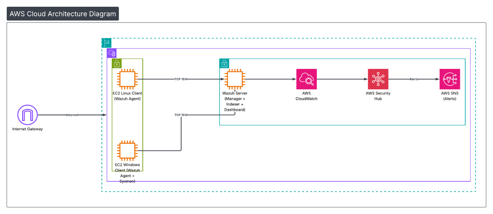

La figure suivante présente l’architecture générale du projet
Wazuh SIEM & EDR déployé sur AWS. Elle montre le serveur Wazuh
centralisant les événements de sécurité provenant des endpoints
Linux et Windows à travers des communications sécurisées.

Cette architecture permet une supervision centralisée,
multi-OS et conforme aux bonnes pratiques d’un SOC moderne.

