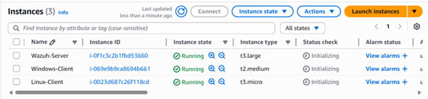
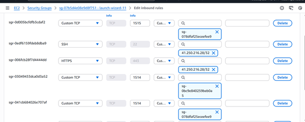
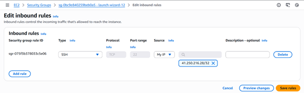
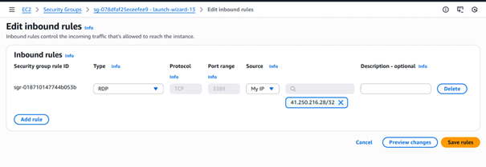

# Architecture générale du laboratoire

## Vue d’ensemble
L’infrastructure repose sur une VPC AWS unique hébergeant
trois instances EC2 communicantes.

Les instances sont :
- Serveur Wazuh (Ubuntu 22.04)
- Client Linux (Ubuntu 22.04)
- Client Windows (Windows Server)

## Groupes de sécurité
Les règles de sécurité sont volontairement restrictives.

Ces règles garantissent que seules les communications nécessaires
au fonctionnement de Wazuh sont autorisées.

