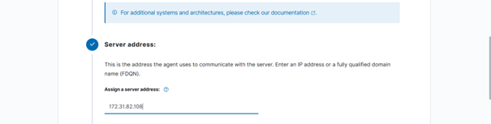
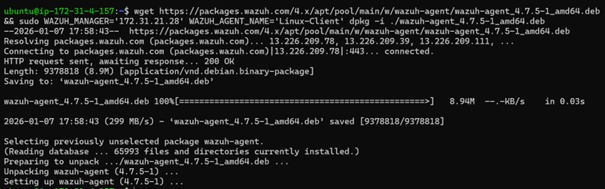
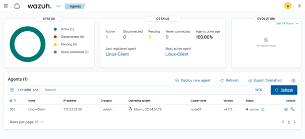

# Enrôlement de l’agent Linux

## Agent Linux
L’agent Wazuh est déployé via le Dashboard.

L’adresse IP privée du serveur Wazuh est utilisée
pour l’enrôlement.

## Installation de l’agent
Les commandes générées sont exécutées sur le client Linux.

## État de l’agent
L’agent apparaît avec l’état **Active**.

