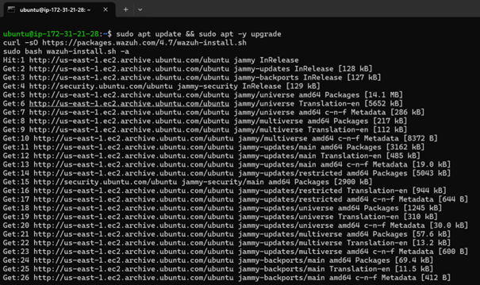
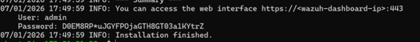
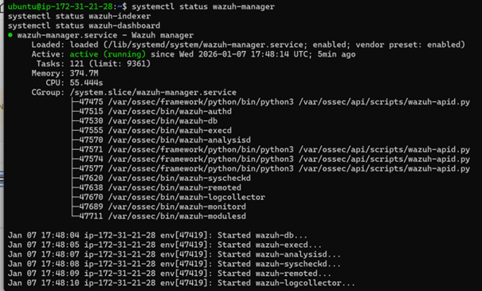

# Installation du serveur Wazuh

## Installation
Le serveur Wazuh a été installé en mode **All-in-One**
à l’aide du script officiel.

À l’issue de l’installation, les informations d’accès
au Dashboard sont générées automatiquement.

## Accès à la plateforme
Le Dashboard Wazuh permet de visualiser les alertes
et l’état des agents.

## Vérification des services
Les services critiques ont été vérifiés avec succès.

