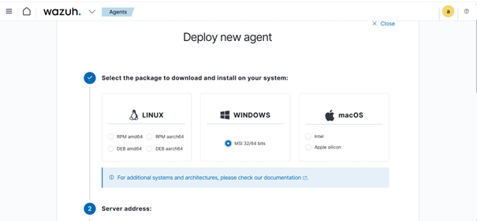
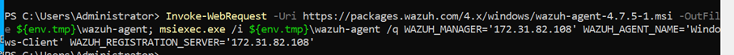
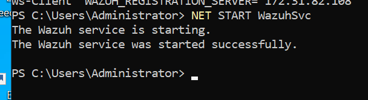
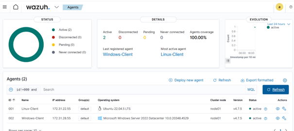

# Installation de l’agent Wazuh – Client Windows

## Environnement
- OS : Windows Server
- Type : Instance EC2

## Méthode d’installation
L’agent Wazuh est installé via **PowerShell**
en tant qu’administrateur, à partir des commandes
générées dans le Dashboard Wazuh.
## Étapes
1. Accéder au Dashboard Wazuh
2. Aller dans **Deploy new agent**

3. Sélectionner :
   - Operating system : Windows
4. Copier la commande PowerShell
5. Exécuter la commande dans PowerShell (Admin)

## Vérification
- Le service **Wazuh Agent** est en cours d’exécution
- Les événements Windows Security sont remontés vers le serveur
- 
## Vérification du service
Le service Wazuh Agent est actif.

