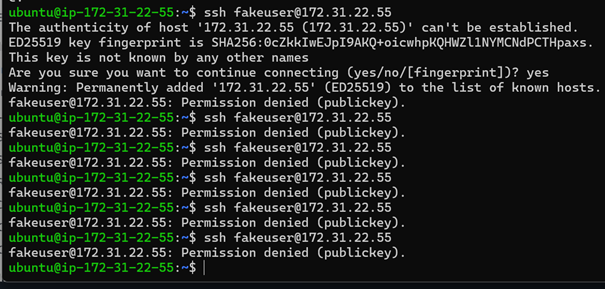
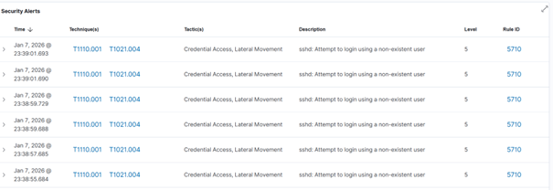
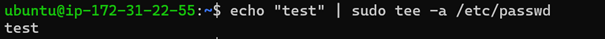
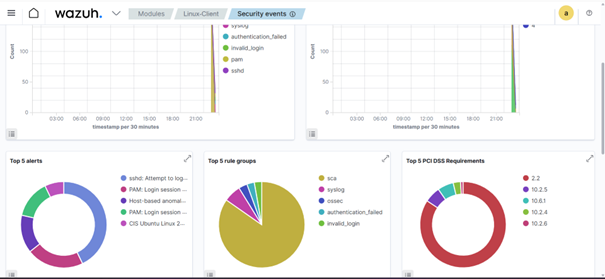

# Scénarios SIEM – Linux

## Tentatives SSH échouées
Des tentatives SSH échouées sont détectées
et centralisées par Wazuh.

## Alertes d’authentification
Les alertes “authentication failed” sont générées.

## Élévation de privilèges
Les actions sudo sont tracées.

## File Integrity Monitoring
La modification du fichier /etc/passwd
génère une alerte critique.

## Statistiques
Vue globale des événements de sécurité Linux.

