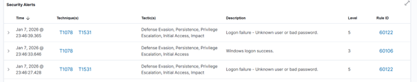
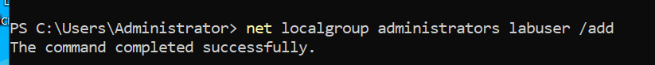
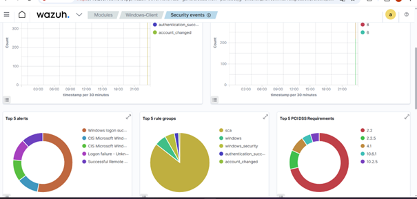

# Scénarios EDR – Windows

## Échecs de connexion
Les échecs de connexion (Event ID 4625)
sont détectés par Wazuh.

## Création d’utilisateur
La création d’un utilisateur est surveillée.

## Modification de privilèges
L’ajout au groupe Administrators est détecté.

## Statistiques
Vue globale des événements Windows Security.

